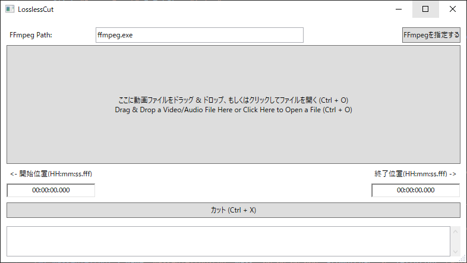

# LosslessCut
This Program just calls FFmpeg command line tool like below:  
`$ ffmpeg -ss 00:00:00 -t 00:10:00 -i input.mp4 -c:v copy -c:a copy -async 1 output.mp4`  
cutting a video/audio file without loss and encoding time.  

## Usage
1. Drag&Drop a video/audio file on `[ここに動画ファイルを...]` or just Press It
2. Set Start and End Time
3. Press `[カット (Ctrl + X)]` Button

## Tips
You can move your cursor with the `Tab` key between StartTime Form, EndTime Form, and Cut Button.  
`Ctrl + X` shortcut key acts as Cut Button.

## Settings
1. Download FFmpeg from [https://ffmpeg.org/](https://ffmpeg.org/) and Install it
2. Set Windows "PATH" Environment Variable for `ffmpeg.exe` or to Click `[FFmpegを指定する]` to Set the FFmpeg Path Locally
